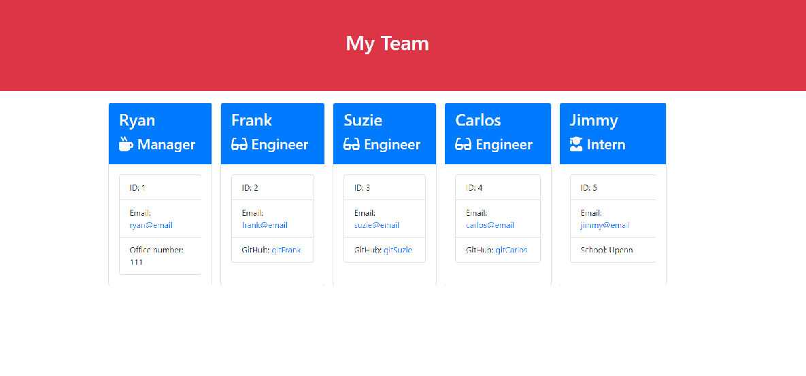

# Template Engine - Employee Summary
  
  

  ## Description 
  
  For this project we were asked to build a software engineering team command line application.  This application will prompt the user for information about the team manager and then information about the team members.  The user can input any number of team members, and they can be any mix of engineers and interns.  We also utilize tests the check to make sure the code is working properly.

  ## Table of Contents

  * [Installation](#Installation)
  * [Usage](#Usage)
  * [Contributing](#Contributing)
  * [Tests](#Tests)
  * [Questions](#Questions)
  
  ##  Installation

  make sure you have npm installed, and run app.js in the command line.

  ## Usage

  Once you run app.js in the command line the application will ask you a series of questions, starting with information about your manager, followed by any number of engineers and interns you want to add.  Once you have added all the employees you wish to add, select "no more employees" and it will render your information in the output folder as an html file.

  

  ## License

  This project is licensed under the MIT license.
  

  ## Tests

  In the test folder we have a series of tests for each class of employee to verify they are working.

  ## Questions

  If you have any questions you can check out my github account: [Rseckman](https://github.com/Rseckman)
  or contact me at rseckman@hotmail.com